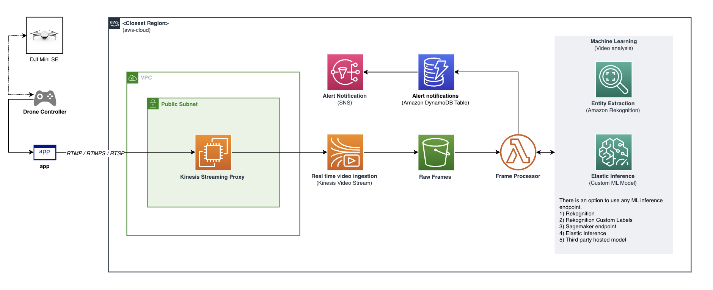
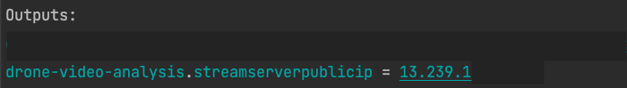
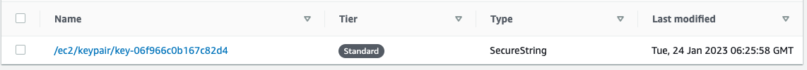
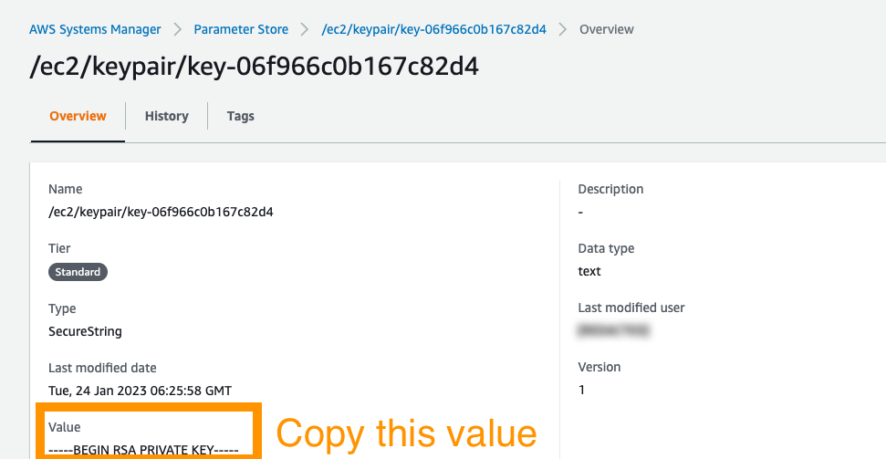
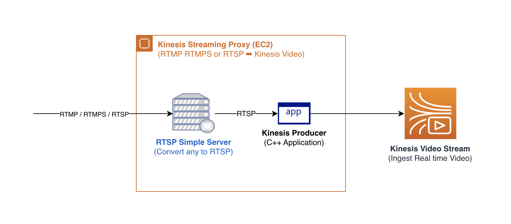

# Drone Video Analysis
This repository contains an application that lets you ingest live drone streams and process them in real time. The application is built using the following technologies:
* Amazon Kinesis Video Streams
* Amazon Rekognition
* Lambda, S3, SNS

The solution has three big components; ingestion, processing of the video stream, and ML analysis of the video stream. 

This solution is useful for processing real-time video streams from drones and other video sources. The solution can be used to detect objects in the video stream, and send alerts to the user when an object is detected.

### CDK Deployment and Usage
The solution is packaged as a CDK stack. The stack be deployed by the following commands
```shell
cd cdk
npm install
cdk deploy
```

This spins up the required resources in your AWS account. The stack creates the following resources:
* Kinesis Video Stream
* Frames storage S3 bucket
* Lambda function to process the video stream
* Streaming Proxy Server to ingest the video stream into Kinesis Video Stream
* All required permissions, security groups, roles and networking resources


### Lambda Configuration
The source code for the lambda function is located in `/cdk/lambda/s3-frame-analysis-trigger.py`

By default, this function will pick up images from the deployed S3 Bucket. It will run the images against the Rekognition API and send an SNS notification if an object of interest is detected in the image. 

If you want to use the custom model, uncomment the code between `Region: Custom model detection snippet` and `End region` and update the `model_arn` variable with the ARN of your custom model.

Ensure you have configured the SNS topic as an environment variable in the lambda function.


### Custom  model
The following are useful resources to create a custom rekognition model:
* [Amazon Rekognition Custom Labels](https://docs.aws.amazon.com/rekognition/latest/customlabels-dg/what-is.html)
* [Getting started with Amazon Rekognition Custom Labels](https://docs.aws.amazon.com/rekognition/latest/customlabels-dg/getting-started.html)


## Architecture
### Full architecture

* The solution uses Kinesis Video Streams to ingest the video stream from the drone. The video stream is ingested using the Streaming Proxy Server.
* The Streaming Proxy Server is a custom application that is deployed on EC2 to convert between RTMP and Kinesis Video Streams. 
* Kinesis Video Streams automatically extracts frames from the video stream and stores them in S3.
* The Lambda function is triggered when a new frame is available in S3. The Lambda function uses Amazon Rekognition to detect objects in the frame.
* The Lambda function sends an alert to the user when an object of interest is detected in the frame.

### Streaming proxy
It allows you to stream video via RTMP or RTSP protocols. The proxy server is deployed on EC2 and is configured to ingest the video stream into Kinesis Video Streams.


To obtain the `<ip_address>` refer to the CDK Stack output.



#### Configuring and starting the proxy server. 
Currently, you must manually start the proxy server. The following steps will help you configure and start the proxy server.

Get the SSH KeyPair Private key. This will be stored in `Parameter Store`



Copy the value and save it to a file named `private.pem`.


Change the permissions of the file to `400` using the following command:
```shell
chmod 400 private.pem
```

Now SSH into the EC2 instance using the following command:
```shell
ssh -i private.pem ec2-user@<ec2-ip-address>
```

Once you are logged into the EC2 instance, run the following commands to start the proxy server:
```shell
ls -l
cd rtsp-proxy-code
sudo chmod +x start.sh
sudo ./start.sh
```

Then you can start the compose application. 
```shell
sudo docker-compose up -d
```

⚠️ This may take a while the first time. The docker image is large and needs to be downloaded.


#### Streaming a sample video
To stream a sample video to the Kinesis Video Stream, you can use the following command:

```shell
ffmpeg -re -stream_loop -1 -i <videofile.mp4> -c copy -f flv \
  rtmp://<ip_address>:1935/<track_name>
```

You can pick any stream name, it essentially acts as a track for the video to publish from the source to the proxy.

Make a note of the `<track_name>` you used.

To start forwarding the video stream to Kinesis Video Streams, you can use the following command from your laptop. 
Streaming proxy will forward the RTMP stream to Kinesis Video Stream specified in the command.

`<stream-name>` is the name of the KVS stream you want to forward to. 


```shell
curl -X POST -H "Content-Type: application/json" \
    -d '{"kinesis_stream_name": "<stream-name>", "rtsp_src": "rtsp://rtspserver:8554/<track-name>"}' \
    http://<ip-address>:8080/trigger
```



* The Streaming Proxy Server is a custom application that is deployed on EC2 to convert between RTMP and Kinesis Video Streams.
* It uses the [KVS Producer C++ Application](https://github.com/awslabs/amazon-kinesis-video-streams-producer-sdk-cpp) to ingest the video stream into Kinesis Video Streams.
* Open source [RTSP Simple Server](https://github.com/aler9/rtsp-simple-server) is used to convert the RTMP stream to RTSP stream.


## CV Model Datasets
Open source datasets for shark detection model
* [Test dataset](https://universe.roboflow.com/d4ms/sharkspotting-2shbe/dataset/3)
* [Training dataset](https://universe.roboflow.com/augie-doebling/sharkspotting)

Download the dataset in the PyTorch format and you can convert it to Ground Truth format using the following script.
This can be uploaded to Amazon Rekognition Custom Labels to train a custom model by choosing the Manifest file option. 

Alternatively, if you do not have any labeled data, you can use the [Amazon Rekognition Custom Labels](https://docs.aws.amazon.com/rekognition/latest/customlabels-dg/md-localize-objects.html) console to label the images and train the model.


## Cleanup
Actively running the solution can cost money, please shut down the resources or destroy the stack.
```
cdk destroy
```


## Notes
* The solution is not intended for production use. It is intended to be used as a reference architecture for building a similar solution.
* In the works: automated proxy server deployment and starting.
* In the works: full demonstration video.

